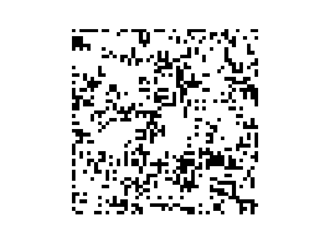

# Conway's Game of Life

## Why

Have you evere heard about Conway's Game of Life (or 'Life')? If you want a detailed explanation about it, [click here](https://en.wikipedia.org/wiki/Conway%27s_Game_of_Life).
What really draws my attenttion about this game is its simplicity and, at the same time, complexity.

Conway's Game of Life consists of basically four rules:

1. Any live cell with fewer than two live neighbours dies, as if by underpopulation.
2. Any live cell with two or three live neighbours lives on to the next generation.
3. Any live cell with more than three live neighbours dies, as if by overpopulation.
4. Any dead cell with exactly three live neighbours becomes a live cell, as if by reproduction.

By giving to the application an initial state (or seed), the next generation is obtained applying these rules, meaning one state is a pure function of the preceeding one.

Life is undecidable, which means that given an initial pattern and a later pattern, no algorithm exists that can tell whether the later pattern is ever going to appear. This is a corollary of the halting problem: the problem of determining whether a given program will finish running or continue to run forever from an initial input.

## How

Implementing Conway's Game of Life is not very challenging because the rules are independent and cna be translated to 3 if statements. What is really challenging is optimizing the code so we don't run in a lot of complexity. Most implementations use various nestes for loops, what result in exponential complexity.

In this implementation, to obtain the number of living neighbors for each cell I'm using convolutions. The kernel filter is very simple and it computes the sum of a unit-thick square border.

```python
# Our Kernel Filter
[[1, 1, 1],
[1, 0, 1],
[1, 1, 1]]
```

## Results so far

I'm using matplotlib.animation to generate and save gif of the Conway's Game of Life. A simple result obtained using this application is shown below:



## TODO

I want to add a simple UI where users will be able to generate the initial state clicking squares that should be alive.
